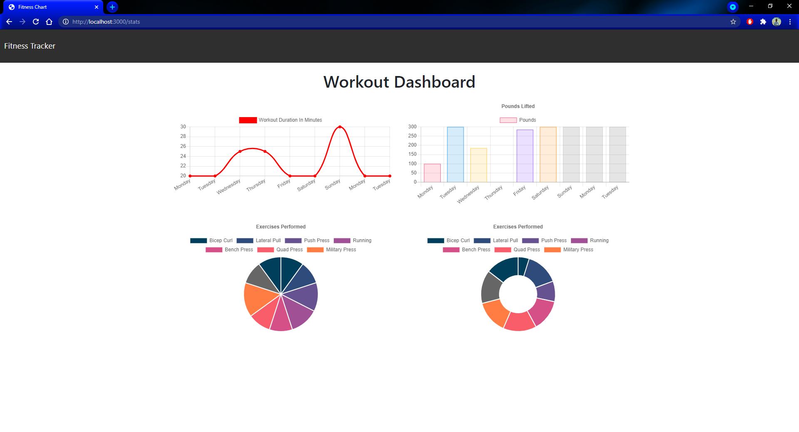
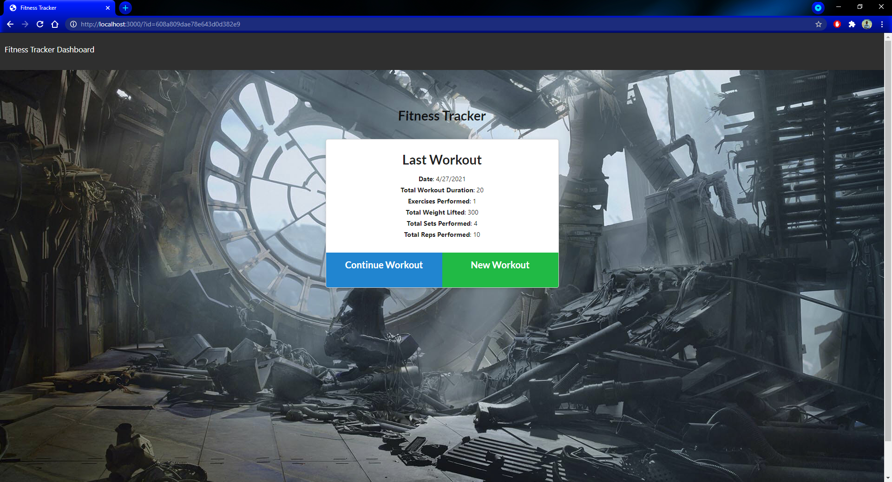

# Introduction

As a user, I want to be able to view create and track daily workouts. I want to be able to log multiple exercises in a workout on a given day. I should also be able to track the name, type, weight, sets, reps, and duration of exercise. If the exercise is a cardio exercise, I should be able to track my distance traveled.

### About:

### Portfolio:

---

## About the project

For this project I have used **mongoDB**, classified as a **NoSQL** database program that uses **JSON** like documents with schemas.

## Run
**1.Run the following command** - `mongo`

**2.Open 2nd command line** - `npm run seed`

**3.Run the this command to start your server** - `npm start`

##### Credits:
* [MongoDB Manual](https://docs.mongodb.com/manual/)
* [Robo3T](https://studio3t.com)
* [npm](https://www.npmjs.com/)
* [Heroku](www.heroku.com)
* [Bootstrap](https://getbootstrap.com/)
* [Google](https://www.google.com/)
* [W3Schools](https://www.w3schools.com/)
* [MDB](https://mdbootstrap.com/)
* [Giphy](https://giphy.com/)

##### Contributors:

* matachemarius92@gmail.com
* [Matache Marius](https://github.com/MatacheMarius)
##### Directory:
* [Current Repository](https://matachemarius.github.io/Workout-Tracker/)
* [Website](https://matachemarius.github.io/Workout-Tracker/)
* [Heroku Deployment]