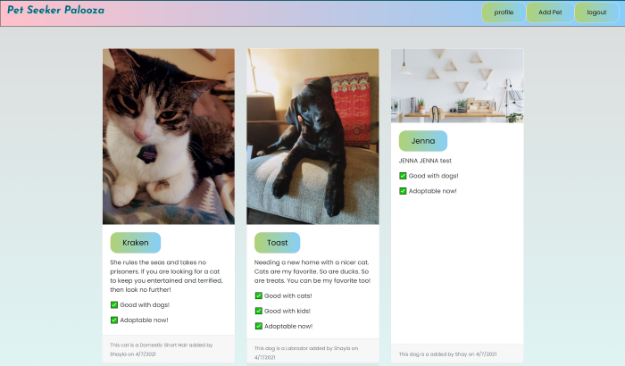
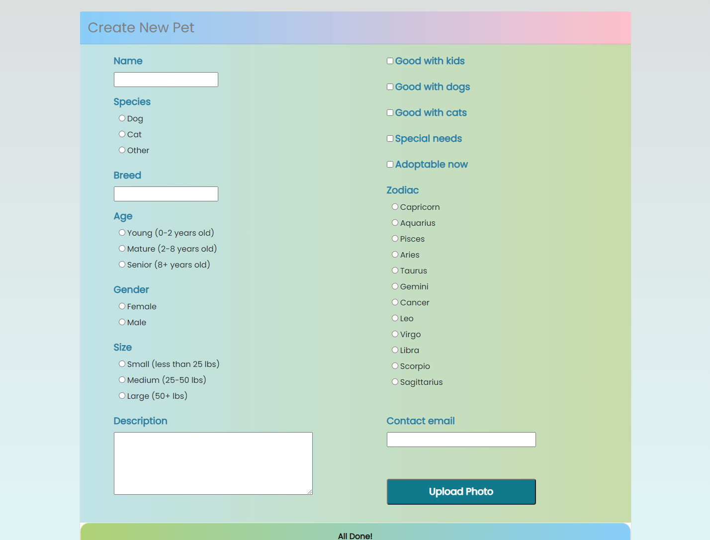

# PetSeekerPalooza_db

## Table of Contents

* [About-project](#Description)
* [Images](#Images)
* [Instalation](#Instalation)
* [Project Requirements](#Project-Requirements)
* [Contributor](#Contributor)
* [Email-adress](#Email)
* [GitHub-profile](#GitHub-profile)
* [Heroku](#Heroku)

   
### About the project:

This app has a homepage that displays the basics of each pet posted on Pet Seeker Palooza. Users can click through into individual pets, and also upload new pets into the Pet Seeker Palooza database to be stored for other users to interact with. 

Future developmet plans include adding a search funciton to allow users to peruse the pets on the app, searching for characteristics they want in pets, an ability to favorite animals, and more species options. 

### Images:
 

 

### Instalation:
* In the console run - node seeds/seed.js
* In the console run - Noder server.js

### Project Requirements:

* Use Node.js and Express.js to create a RESTful API.

* Use Handlebars.js as the template engine.

* Use MySQL and the Sequelize ORM for the database.

* Have both GET and POST routes for retrieving and adding new data.

* Use at least one new library, package, or technology that we haven’t discussed, we used cloudinary to allow users to upload pictures of their pets to be stored in the app. 

* Have a folder structure that meets the MVC paradigm.

* Include authentication (express-session and cookies).

* Protect API keys and sensitive information with environment variables.

* Be deployed using Heroku (with data).

* Have a polished UI.

* Be responsive.

* Be interactive (i.e., accept and respond to user input).

* Meet good-quality coding standards (file structure, naming conventions, follows best practices for class/id naming conventions, indentation, quality comments, etc.).

* Have a professional README (with unique name, description, technologies used, screenshot, and link to deployed application).

### Contributor:
* Matache Marius
* Conor O'Brien
* Shayla Stevenson
* Jon Ekes
* Victoria Garner

### Email adress:
* matachemarius92@gmail.com
* jrekse@gmail.com
* shaylarose11@gmail.com
* obrienceob@gmail.com

### GitHub profile:
* https://github.com/ShaylaStevenson/PetSeekerPalooza
* https://github.com/obrienceob
* https://github.com/ShaylaStevenson
* https://github.com/Jrekse

### Heroku:
* https://shrouded-lake-69367.herokuapp.com/

